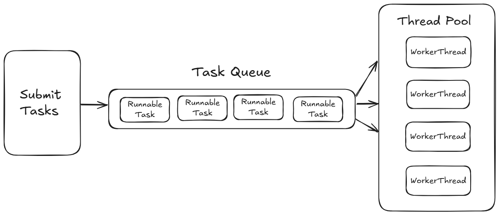

# Efficient-Task-Execution-with-Custom-Thread-Pool
<p align="center">
  
</p>

This implementation demonstrates how to efficiently manage and execute multiple tasks using a custom thread pool backed by a BlockingQueue. Instead of creating a new thread for every task, a fixed number of worker threads continuously fetch and execute tasks from the queue, optimizing resource utilization and improving performance.

# 🔄 How It Works

1️⃣ A BlockingQueue holds incoming tasks (Runnable jobs).

2️⃣ A fixed number of worker threads are created at initialization. 

3️⃣ When a task is submitted, it gets added to the queue.

4️⃣ Worker threads continuously fetch and execute tasks from the queue.

5️⃣ If the queue is full, task submission is blocked until space is available.

6️⃣ If the queue is empty, worker threads wait (block) until new tasks arrive.

7️⃣ The thread pool can be gracefully shut down, allowing ongoing tasks to complete.

# 🎯 Use Cases

✅ Web Servers: Handling multiple client requests efficiently.

✅ Job Scheduling: Background task execution in microservices.

✅ Database Connection Pooling: Managing a pool of connections efficiently.

✅ Logging Systems: Asynchronously writing logs to improve performance.

## **Installation**  

1. **Clone the repository (if applicable):**  
   ```sh
   git clone https://github.com/jayitasaha40/Efficient-Task-Execution-with-Custom-Thread-Pool.git
   cd Efficient-Task-Execution-with-Custom-Thread-Pool
   ```

## **Project Structure**  

```
/src/main/java
│── com/taskexecutor
│   ├── assests
│       ├── diagram1.png
│       ├── diagram2.png
│   ├── Main.java
│   ├── CustomThreadPool.java
│   ├── WorkerThread.java
│   ├── Task.java
│── README.md
```

## **Expected Behavior**  

- Worker threads wait for tasks when the queue is empty.  
- As soon as a new task is submitted, an available worker picks it up immediately.  
- The thread pool can be shut down gracefully after execution.  

## **Example Output**  

```
Worker Thread-0 is waiting for a task...
Worker Thread-1 is waiting for a task...
Worker Thread-0 picked up a task.
Task 1 is running by the Thread <Thread-0>
Worker Thread-1 picked up a task.
Task 2 is running by the Thread <Thread-1>
Worker Thread-0 is waiting for a task...
Worker Thread-1 is waiting for a task...
```

## **License**  
This project is licensed under the MIT License.  

